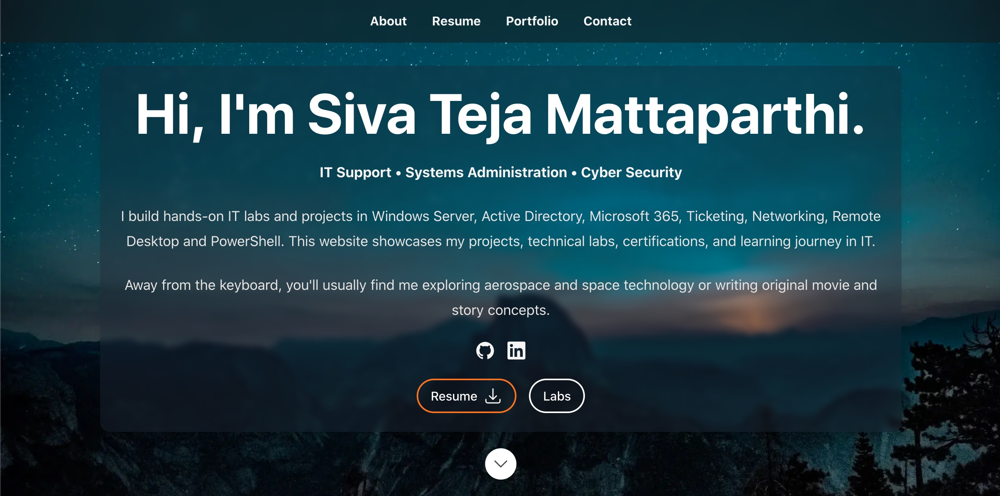

# Siva Teja Mattaparthi | IT Support & Systems Administration Portfolio



## About

Welcome to my personal portfolio repository.

This website showcases my projects, home labs, certifications, technical articles, and hands-on experience while preparing for IT Support, Systems Administration, and Cloud Infrastructure roles.

The portfolio is built using **Next.js**, **React**, **TypeScript**, and **Tailwind CSS**, and is continuously updated as I complete new labs and certifications.

---

## Website Features

- Resume Download
- Hands-on IT Labs
- Technical Articles
- Skills Overview
- Contact Form
- Responsive Design
- Dark Theme

---

## Current Labs & Projects

- Windows Server Administration
- Active Directory Home Lab
- Microsoft 365 Administration
- Microsoft Intune
- Microsoft Entra ID
- Azure Virtual Machines
- Group Policy Management
- PowerShell Automation
- Networking Labs
- Microsoft Sentinel
- IT Support Troubleshooting

More labs are added regularly.

---

## Technical Articles

### OSI Model: Networking Explained Like a Bro Before an Exam

A beginner-friendly explanation of the OSI Model with real-world examples.

Read here:

https://www.linkedin.com/pulse/osi-model-networking-explained-like-bro-before-exam-mattaparthi--lf4gc

---

## Tech Stack

- Next.js
- React
- TypeScript
- Tailwind CSS
- Node.js

---

## Local Development

Clone the repository

```bash
git clone https://github.com/sivateja07/portfolio.git
```

Install dependencies

```bash
yarn install
```

Run locally

```bash
yarn dev
```

---

## Live Portfolio

Coming Soon

---

## Connect With Me

**Email**

mattaparthisivateja@gmail.com

**LinkedIn**

https://www.linkedin.com/in/sivateja-mattaparthi-2ba302230/

**GitHub**

https://github.com/sivateja07

---

## Future Additions

- Active Directory Enterprise Lab
- Microsoft Intune Lab Series
- Azure Administration Labs
- PowerShell Automation Scripts
- IT Support Knowledge Base
- Certification Showcase
- Technical Blog Archive

---

## Acknowledgements

This portfolio is built upon the excellent open-source **React Resume Template** created by **Tim Baker**.

The project has been extensively customized and adapted to showcase my own projects, home labs, certifications, and technical articles.

Original project:
https://github.com/tbakerx/react-resume-template

---
© 2026 Siva Teja Mattaparthi